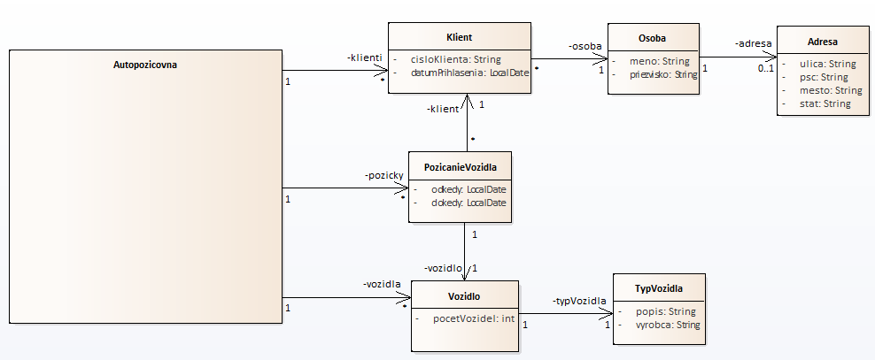

# Autopožičovňa
 
Úlohou je implementovať požičovňu vozidiel.
K zadaniu je priložený diagram, ktorý popisuje základné pojmy v doméne:

## Pojmy a ich význam

* Autopozicovna - Obsahuje zoznam klientov, pôžičiek a aj vozidiel. Umožňuje vykonávať základné operácie ako je požičanie vozidla, vrátenie vozidla, ale aj zaradenie vozidla/klienta do evidencie
* Klient - osoba, ktorá je zaevidovaná v zozname klientov autopožičovne
* Osoba - trieda drží základné informácie o človeku ako meno, priezvisko a jeho adresa
* Adresa - trieda obsahuje všetky podstatné informácie o adrese ako je ulica, PSČ, obec a štát
* Vozidlo - evidencia vozidiel v autopožičovne. Vozidlo konkrétneho typu môže byť v autopožičovni evidované viackrát, čiže vo viacerých kusoch
* TypVozidla - trieda popisuje základné informácie o vozidle ako je jeho popis a výrobca

## Bližšie pokyny k implementácii

1. Implementujte jednotlivé pojmy postupne. Nesnažte sa urobiť všetko naraz.
2. Využívajte možnosť vložiť System.out.println všade tam, kde si budete potrebovať potvrdiť, čo systém robí.
3. Všetky nové triedy vytvárajte len v package-i sk.skolenie.autopozicovna.domain.
3. Ako prvé implementujte triedu AutopozicovnaFactory. V rámci riešenia tejto triedy bude nutné povytvárať aj všetky ostatné, t.j. Klient, Osoba, Vozidlo atď.
4. Bolo by šikovné, ak by ste zvládli použiť aj unit testy. Zadanie to priamo nevyžaduje, ale JUnit je už začlenený do projektu, ak by ste si to chceli vyskúšať.
5. Nie je nutné zapisovať triedu Autopozicovna do súboru na disk. Môžete si to vyskúšať na záver, ak vám ostane čas a chuť.
6. Zadanie nevyžaduje publikovať metódy ako REST-ové API. Toto sme neskúšali a ani sa do toho nepúšťajte - môžete sa zbytočne zamotať.t